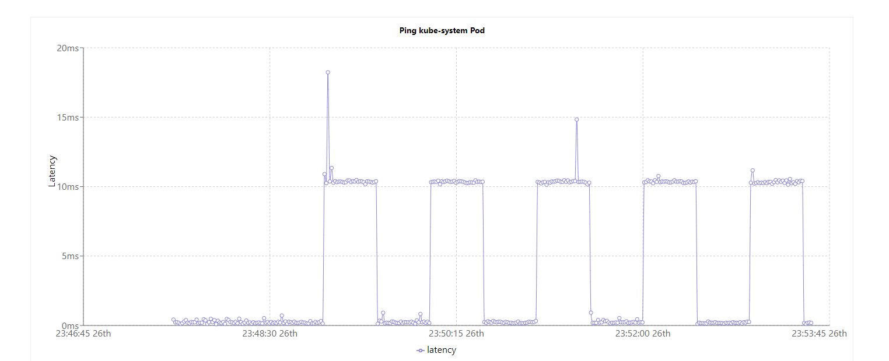

## Network Delay Experiment
Your first experiment will apply a network delay to an application.

#### Install Example Web-show application
Install an example application as a target for the experiment. This application is designed by the Chaos Mesh project as a *hello world* example for your first experiment. 

We provided a shell script for you to start this application which monitor the web day in realtime.
Run `deploy.sh`{{execute}} and it would start the deployment. It will take a moment to start. You can see the application status and the Pods status will soon report Running in the default namespace:

`kubectl get deployments,pods,services`{{execute}}

With the web-show application running, its web interface can be accessed from the "Web Show" above the command-line area or this link: [Web Show]({{TRAFFIC_HOST1_8081}}).

## Define Experiment
The Chaos Mesh has installed several custom resources:

`kubectl get crds`{{execute}}

You can reference these resources to create declarative YAML manifests that define your experiment. For your first experiment, you will impose a network delay. The delay is defined in the NetworkChaos manifest this way:

`cat network-delay.yaml`{{execute}}

The experiment declares that a 10ms network delay should be injected. The delay will only be applied to the target service labeled "app": "web-show". This is the blast radius. Only the web-show app has that label:

`kubectl get deployments,pods -l app='web-show'`{{execute}}

Apply Experiment
Because the Chaos Mesh follows the Kubernetes Operator pattern with CRDs, the experiment can be applied like any other Kubernetes object.

`kubectl apply -f network-delay.yaml`{{execute}}

After run the above command, chances are that you need to wait for a minute to wait for the schedule to start an eperiment. 
Run this script to wait for the experiment to be applied, `wait-delay`{{execute}}
You can check the status via the Chaos Mesh dashboard or using `kubectl get NetworkChaos`{{execute}}

## Observe
Access the web-show application (or use the tab). The application has a built-in graph that will show the latency it's experiencing. With the experiment applied you will see the 10ms delay. Look at the dashboard, find the experiment, and drill down on its details.

Once you enter the front-end of this web show application, you will see a graph which plots the latency to ping the cluster. If the experiment is successfully running, you will see a graph like the following one.

## Update Experiment
At any time you can change the YAML declaration and apply further experiment updates with:

`kubectl apply -f network-delay.yaml`{{execute}}

The experiment can be paused:

`kubectl annotate networkchaos web-show-network-delay experiment.chaos-mesh.org/pause=true`{{execute}}
and resumed:

`kubectl annotate networkchaos web-show-network-delay experiment.chaos-mesh.org/pause-`{{execute}}

Since the NetworkChaos is like any other Kubernetes resource, the experiment can be easily removed.

`kubectl delete -f network-delay.yaml`{{execute}}